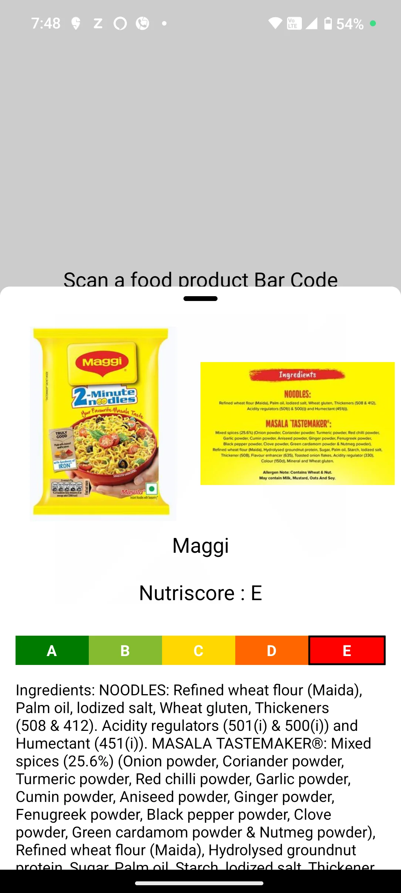

# Nutrifact - Check your food stats

Nutrifact is a app to scan food items get their nutritional facts and rating uses openfoodfacts api to get the nutritional facts and uses expo camera for scanning barcodes

# Screenshots

## Made By Ansh Wadhwa
Open source under ANU GPL 3.0